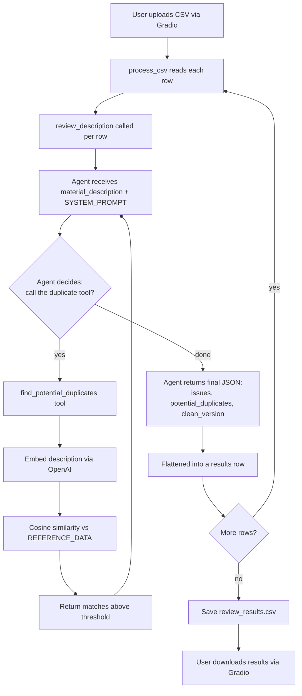
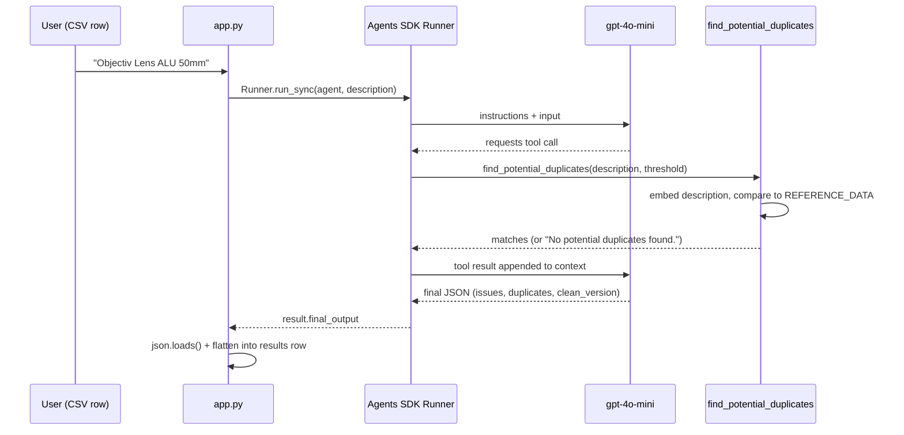

# Material Description Quality Agent

An AI agent that reviews SAP material master descriptions (MAKTX-style text) for typos, inconsistent abbreviations, and potential duplicates, and suggests a cleaned-up version — via a simple CSV-in, CSV-out Gradio interface.

---

## What it does

You upload a CSV of material descriptions. For each row, the agent:

1. Checks the description for typos and non-standardized abbreviations
2. Calls a tool to search existing SAP material master data for semantically similar descriptions (using OpenAI embeddings + cosine similarity)
3. Proposes a cleaned-up, standardized description
4. Returns all of this as structured data, which gets flattened into a results CSV you can download

---

## Step-by-step flow



---

## Sequence of one row's review

This is the turn-by-turn exchange between the app, the agent runtime, the LLM, and the tool for a single material description:



---

## Project structure

```
material_quality_agent/
├── app.py          # Gradio UI, CSV processing, Agent + Runner wiring
├── context.py      # Reference data loading, embeddings, SYSTEM_PROMPT
├── tools.py        # find_potential_duplicates tool (embedding similarity search)
└── data/
    └── materials.csv   # Existing SAP material master reference data
```

**context.py** loads the reference CSV once at startup and pre-computes an embedding for every existing material description, so duplicate checks at query time only need to embed the *new* description and compare it against this cached matrix.

**tools.py** defines the one tool the agent can call: given a new description, it embeds it and returns any existing materials above a similarity threshold (default 0.85).

**app.py** defines the `Agent` (instructions + tools + model), runs it once per CSV row via the `Runner`, parses the JSON response, and wires the whole thing into a Gradio file-upload/download interface.

---

## Manual tool-calling vs. OpenAI Agents SDK

The project was originally built by hand-rolling the OpenAI chat completions tool-calling loop, then migrated to the OpenAI Agents SDK. Both versions produce the same result; the SDK version replaces manual bookkeeping with framework-managed equivalents.

| Concern | Original (manual, `main`) | Current (Agents SDK) |
|---|---|---|
| Tool schema | Hand-written JSON schema dict passed via `tools=[...]` | `@function_tool` decorator generates the schema from the function's type hints + docstring |
| Conversation state | Manually built `messages = [{"role": "system", ...}, {"role": "user", ...}]` list | `SYSTEM_PROMPT` passed once as `instructions=` on the `Agent`; per-call input handled by `Runner` |
| Tool-call loop | Manual: check `response.choices[0].message.tool_calls`, `json.loads()` the arguments, call the function, append a `{"role": "tool", ...}` message, call the API again | `Runner.run_sync(agent, input)` — the SDK detects tool calls, invokes them, feeds results back, and loops until a final answer, internally |
| Dispatching to the right function | Manual `if`/`match` on `tool_call.function.name`, or a lookup dict | Automatic — the SDK matches the model's tool call to the decorated function by name |
| API client | `client.chat.completions.create(...)` called explicitly, twice (once before tools, once after) | Abstracted away — `Runner` manages the underlying calls |
| Safety against runaway loops | None built in — an infinite tool-call loop would run until you killed the process or hit a rate limit | `max_turns` parameter on `Runner.run_sync` caps the number of turns and raises `MaxTurnsExceeded` |
| Debugging / observability | `print()` statements only | Same, plus optional built-in `trace()` — runs get logged to the OpenAI dashboard for a full turn-by-turn view |
| Output format | Prompt-engineered ("Respond ONLY with a JSON object...") + manual `json.loads()` | Same in this project (no `output_type`/Pydantic used) — the SDK also supports enforced structured output via `output_type` if you want the schema validated instead of prompted |

**Net effect:** the SDK version is meaningfully shorter — the entire manual request/response/tool-dispatch loop in `app.py` collapses into a two-line function (`Runner.run_sync` + `json.loads`). The trade-off is one extra dependency (`agents`) and slightly less visibility into the raw API calls unless you turn on debug logging.

---

## Known gotcha worth documenting

Tool return values must be serializable to something the model can meaningfully read. Returning an empty Python list (`[]`) from the tool for a "no duplicates found" case caused the agent to interpret the result as inconclusive and retry the tool call indefinitely (hitting `max_turns`) instead of treating it as a valid final answer. The fix: always return an explicit, non-empty result — a plain string like `"No potential duplicates found."` when there are no matches, and a JSON string of the matches otherwise.

---

## Running it

```bash
uv run app.py
```

Opens a local Gradio interface. Upload a CSV with a `material_description` column; download `review_results.csv` when processing finishes.
